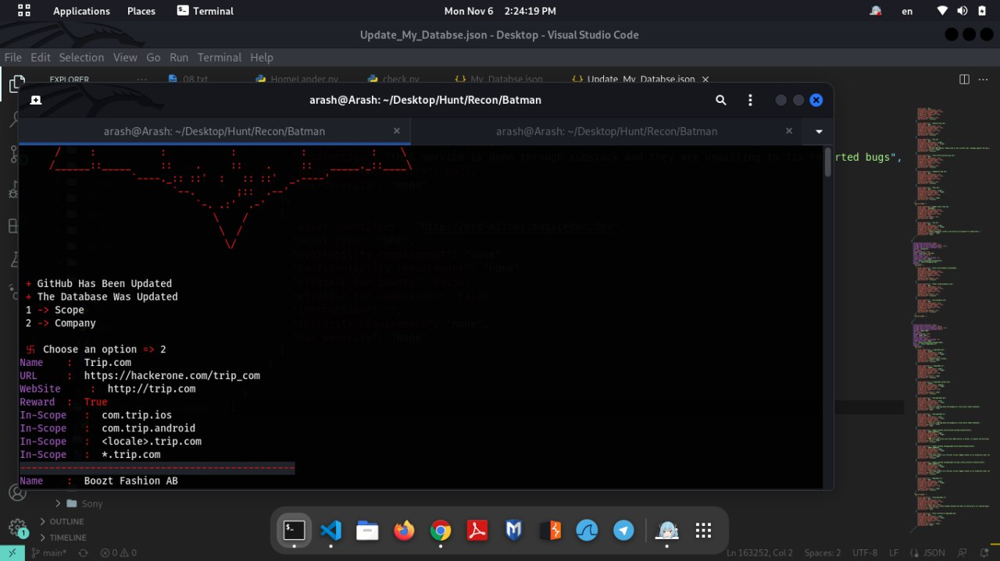

  
  &nbsp;&nbsp;&nbsp;&nbsp;
  

<h1 align="center">Watch Tower</h1>

  Real-Time Asset Monitoring Platform 
  Built with Laravel 12 & Livewire 3

  
  
  
  
  

---

# Real-Time Monitoring Without Blind Spots

Watch Tower is a modern monitoring system designed to detect newly added assets from defined targets and notify you instantly across multiple channels.

Version 2 is a complete architectural rebuild of:

Bat-Tower (Version 1 – Python/Flask CLI)  
https://github.com/Arash-abraham/Bat-Tower  

---

# Product Evolution

## Before Version 1 – The Early Prototype 🛠️

The origin of Watch Tower was humble: a small, local script that I wrote to **monitor HackerOne program updates**.  

It had only one goal: the moment a new asset appeared, I wanted to **know immediately**. There was no dashboard, no notifications beyond the console — just a simple script printing results in real time.  

  

This early version taught me **the power of instant awareness**. Despite being tiny and local, it proved that monitoring could be reactive — not just passive. Every line of code here planted the seed for the fully-fledged Watch Tower platform that would follow. 🚀  

---

## Version 1 – Bat-Tower

- Python + Flask 🐍  
- CLI-only interface  
- Trigger-based detection  
- Discord-only notifications 🔔  
- No dashboard  
- No multi-user support  

Functional, but limited in scope. Bat-Tower was the bridge from experiment to product.

---

## Version 2 – Watch Tower

Rebuilt entirely using:

- Laravel 12  
- Livewire 3  
- Volt class-based components  
- Tailwind CSS  
- Architected for Laravel Echo (WebSocket broadcasting)  

This version introduces:

- Reactive web dashboard 💻  
- Multi-channel notifications (Discord, Telegram, In-App)  
- Authentication system 🔑  
- Scalable architecture 🌐  
- SaaS-ready foundation  

---

# Core Capabilities

## Real-Time Reactive Dashboard

Assets appear instantly without refresh.  
Powered by Livewire 3 reactivity, structured for Laravel Echo integration.  
Designed for speed and clarity. ⚡  

---

## Multi-Channel Notification Engine

When a new asset is detected:

You choose how you’re notified:

- Discord  
- Telegram  
- In-dashboard alerts  
- SMS (planned 📱)  

Unlike v1 which supported only Discord, v2 introduces **redundancy and flexibility**.

---

## Laravel Echo Ready

- WebSocket-powered live broadcasting  
- Real-time UI synchronization  
- Multi-user concurrent updates  
- Future collaborative monitoring features  

---

# Full Comparison — v1 vs v2

| Category | Bat-Tower (v1) | Watch Tower (v2) |
|-----------|----------------|------------------|
| Core Stack | Python + Flask 🐍 | Laravel 12 + Livewire 3 + Volt 🛡️ |
| Interface | CLI Only | Modern Web Dashboard 💻 |
| Real-Time UI | ❌ None | ✅ Live Reactive UI |
| WebSockets | ❌ No | ✅ Laravel Echo Ready |
| Notification Channels | Discord Only | Discord + Telegram + In-App 🔔 |
| SMS Support | ❌ No | Planned 📱 |
| Dashboard | ❌ None | Live Monitoring Panel 📊 |
| Authentication | ❌ None | Built-in Auth 🔑 |
| Multi-User | ❌ No | Architecture Ready 👥 |
| Role System | ❌ No | Expandable 🏷️ |
| Scalability | Script-Based | Full Web Application 🌐 |
| Deployment | Manual | Docker-Ready (WIP) 🐳 |
| Extensibility | Limited | Designed for Growth 🌱 |
| UX | Text Output | Responsive + Dark Mode 🌙 |

Version 1 was a simple experiment.  
Version 2 is a fully functional monitoring platform.

---

# For Users

Watch Tower helps you:

- Detect new assets instantly  
- Reduce manual monitoring  
- Centralize alerts  
- Scale monitoring workflows  
- Eliminate blind spots  

Built for security researchers, DevSecOps teams, and monitoring-heavy workflows. 🔍  

---

# For Investors & Product Vision

Watch Tower is positioned as a **scalable monitoring infrastructure platform**.  

Potential expansion paths:

- SaaS multi-tenant deployment  
- Subscription-based alert tiers  
- Team collaboration features 👥  
- Enterprise integrations  
- API-based monitoring ecosystem  
- Advanced analytics & reporting layer 📊  

With Laravel 12 foundation and reactive architecture, the product is designed for **growth, not just utility**.  

---

# Roadmap

- Full Laravel Echo broadcasting  
- SMS integration (Twilio or similar)  
- Multi-user team dashboards  
- Advanced analytics module  
- Public API  
- CI/CD automation  
- Production Docker setup  
- Comprehensive test coverage ✅  

---

# License

In the world of the internet, everyone should be free to explore, learn, and share 🌐✨  
This project is open to all — because knowledge and tools should not be limited by borders or connectivity. 🚀

For the souls of my brave sisters and brothers in Iran, who rose for freedom and were silenced — over 40,000 voices crushed .  
The world has learned from your courage.  

Long live Iran!
---

## 🤝 Collaboration

Interested in collaborating? You can reach out to me via:

- **Telegram:** [@Octawian](https://t.me/Octawian)  
- **Email:** [arashebi777@gmail.com](mailto:arashebi777@gmail.com)

---

> Made with ❤️ by Arash Abraham
